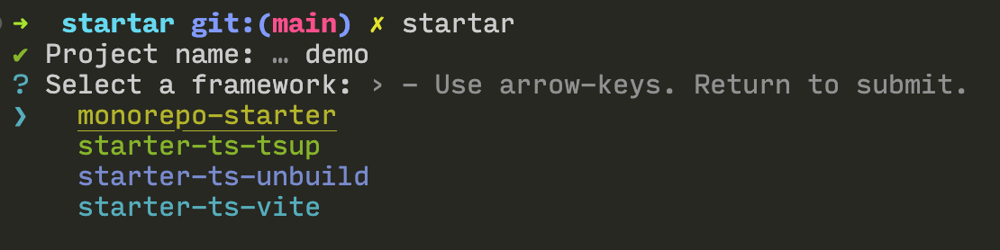

# startar

一个用于快速拉取 TypeScript 项目模板的交互式脚手架。通过 `startar` 你可以在几分钟内选择合适的模板、填写项目信息、初始化 Git 仓库并安装依赖，全流程自动化完成。

## 特性

- 交互式向导，项目名称、作者、描述、许可证、包管理器等信息均可一步配置
- 支持命令行参数快速生成项目，适合在 CI 或脚本中使用
- 内置多种模板，并允许通过本地路径或远程目录引入自定义模板
- 自动替换模板中的项目占位符，自定义 `package.json` 字段
- 可选初始化 Git 仓库与依赖安装，亦可通过 `--no-git`、`--no-deps` 跳过

## 内置模板

| 模板名称 | 描述 | 技术栈 |
| --- | --- | --- |
| `monorepo-starter` | 带 changesets 的 Monorepo 脚手架 | TypeScript、Changesets、ESLint |
| `starter-ts-tsup` | 基于 tsup 的 TypeScript 库模板 | TypeScript、tsup、Vitest、ESLint |
| `starter-ts-unbuild` | 使用 unbuild 的 TypeScript 库模板 | TypeScript、unbuild、Vitest、ESLint |
| `starter-ts-vite` | 面向前端工具的 Vite 模板 | TypeScript、Vite、Rollup |

通过 `startar --list` 可查看同样的信息。

## 快速开始

```bash
# 推荐使用临时执行
npx startar@latest
# 或全局安装
npm i -g startar
startar
```

交互式模式会引导你选择模板并填写项目信息。生成完成后，`startar` 会在目标目录写入模板文件并进行定制化替换。



## 命令行用法

```text
startar [项目目录] [参数]

-t, --template <名称>    使用内置模板名或自定义路径
-a, --author <作者>       指定作者名称
-d, --description <描述>  指定项目简介
-L, --license <协议>      指定许可证，默认 MIT
-p, --packageManager <PM> 指定包管理器（npm / yarn / pnpm）
-y, --yes                 跳过所有询问并使用默认值
-l, --list                查看内置模板列表
    --no-git              跳过 Git 初始化
    --no-deps             跳过依赖安装
-v, --version             查看版本号
-h, --help                查看完整帮助
```

示例：

```bash
startar my-lib -t starter-ts-tsup -a "Sunny" -d "My library" -p pnpm
startar my-app -t ./templates/custom-template --no-git --no-deps
```

如果提供了自定义模板路径，`startar` 会在复制文件时自动替换占位符，并根据项目配置生成 `package.json`。

## 自定义模板

在模板目录中可以使用诸如 `{{name}}`、`{{description}}`、`{{author}}`、`{{license}}`、`{{packageManager}}` 等占位符，`startar` 会在生成项目时自动替换这些字段。

模板文件若包含自定义的 `package.json`，会在拷贝时调用 `customizePackageJson`，用填写的信息覆盖名称、描述、作者等字段。

## 开发

```bash
pnpm install
pnpm dev    # 使用 robuild --watch 进行开发构建
npm link    # 在本地注册 startar 命令
startar
```

发布前请执行 `pnpm build` 以生成 `dist` 产物。
